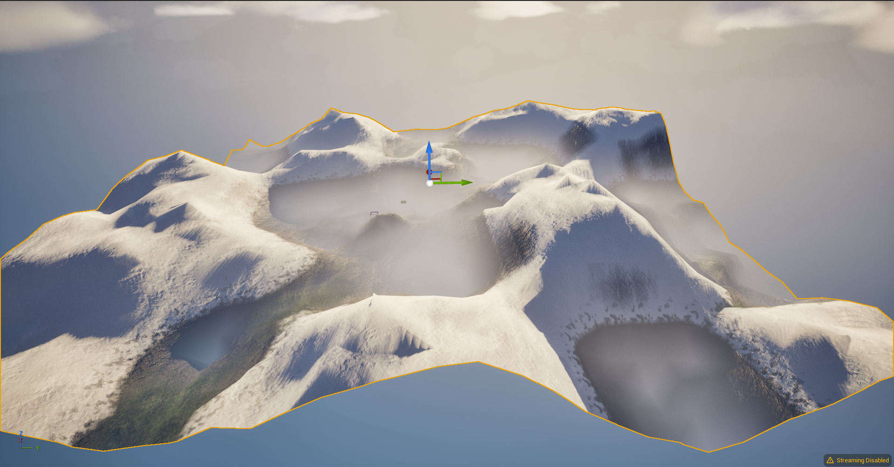
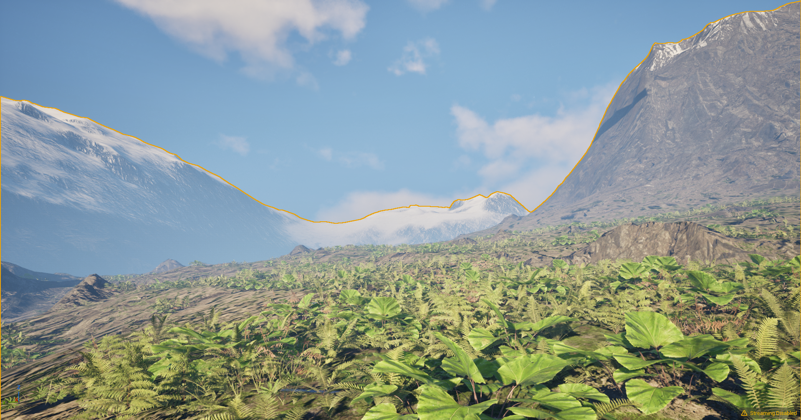
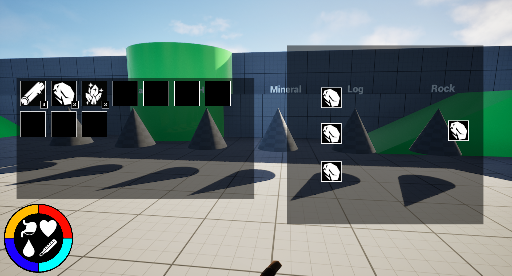
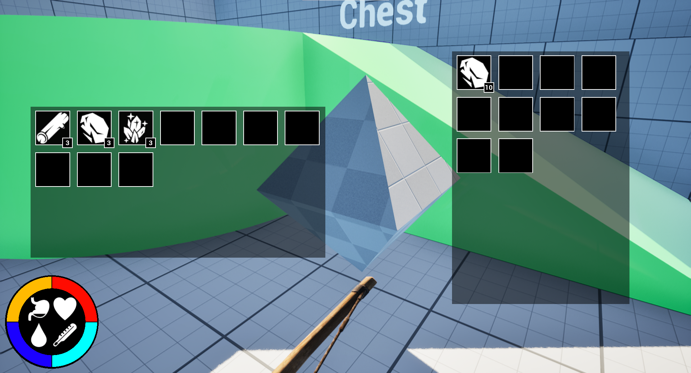
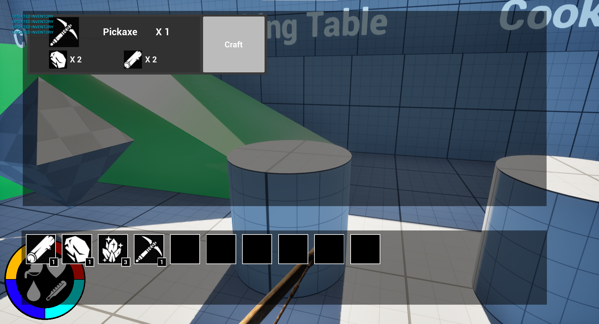
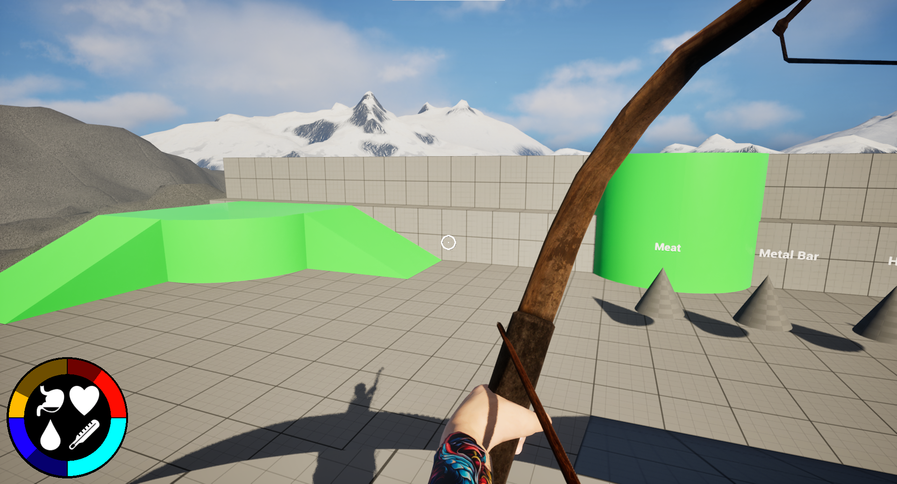
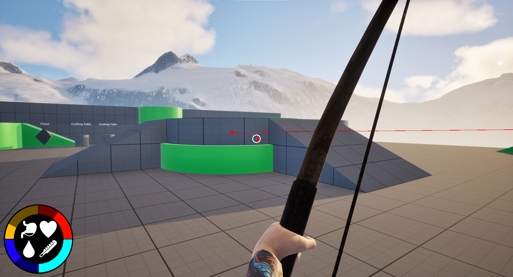

# Unreal_Survival_OpenWorld_Multiplayer_Game

🌍 Open World Survival Multiplayer Project (Unreal Engine 5)
🧩 Overview

A work-in-progress open world multiplayer survival game developed in Unreal Engine 5.
The project focuses on core survival mechanics such as building, crafting, gathering, cooking, and multiplayer gameplay with full Steam integration.

---

⚙️ Current Features

🏗️ Building System — modular construction and placement mechanics.

⛏️ Resource Gathering — mining, chopping, and collecting resources dynamically.

🔨 Crafting System — item creation and management via interactive UI widgets.

🍖 Cooking System — food preparation using crafted tools and campfires.

🏹 First Weapon (Bow) — currently in development, with working aiming and arrow spawning logic.

🌄 Procedural World Generation — implemented using Voxel Plugin, creating terrain dynamically.

🌿 Foliage System — natural world vegetation for realism and immersion.

❤️ Survival Stats — hunger, thirst, and health management systems.

🌐 Multiplayer System (Steam Integration) — host and join sessions, full replication support for all gameplay mechanics.

---

🚀 In Development

⚔️ Combat and enemy AI

🧱 Expanded building materials

🔥 Advanced crafting and cooking recipes

💬 In-game chat and voice system

And much MORE

---

## 🖼️ Screenshots
*(Images from `/Docs/`)*

---

🛠️ Tech Stack

Engine: Unreal Engine 5

Language: Blueprint (and partial C++ integration planned)

Plugins: Voxel Plugin, Online Subsystem Steam

---

🎯 Goals

To create a fully functional survival sandbox multiplayer experience, scalable for future open-world expansion, cooperative gameplay, and AI-driven environments.
